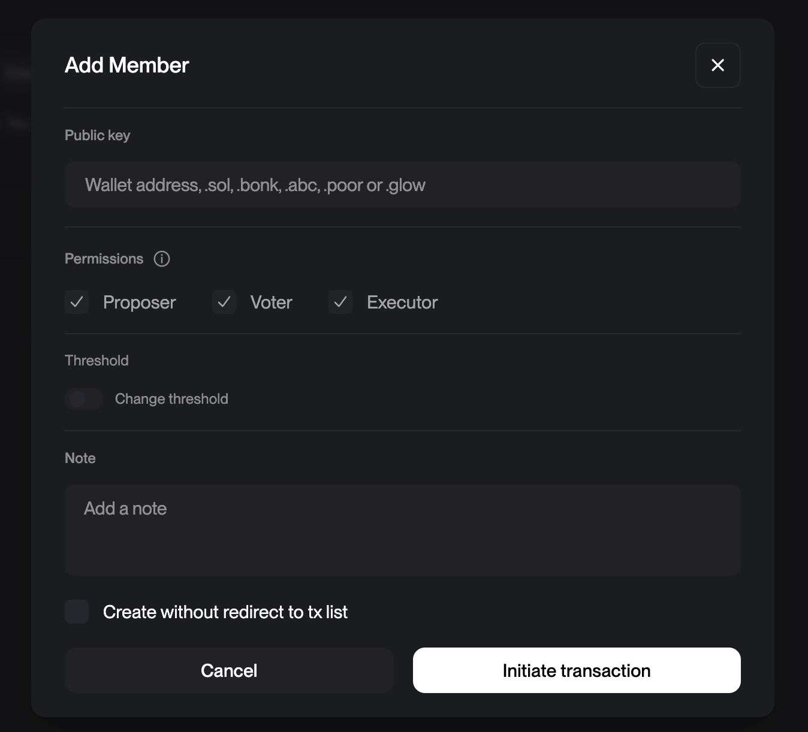

## Run locally using act

```bash
act -W .github/workflows/build.yaml \
 --container-architecture linux/amd64 \
 --secret-file .secrets \
 workflow_dispatch \
 --input program=transaction-example \
 --input network=devnet \
 --input deploy=true \
 --input upload_idl=true
```

# Run tests only

Note: The anchor tests use solana-test-validator which does not work in act docker container on mac because of AVX dependency. Wither run them in github, locally without docker or open PR to fix it. I couldnt find a nice way to fix it.

```bash
act -W .github/workflows/test.yaml \
 --container-architecture linux/amd64 \
 --secret-file .secrets \
 workflow_dispatch \
 --input program=transaction-example
```

## How to setup Squads integration:

In general its recommended to use the [Squads Multisig](https://docs.squads.so/squads-cli/overview) to manage your programs.
It makes your program deployments more secure and is considered good practice. 

1. Setup a new squad in [Squads](https://v4.squads.so/squads/) then transfer your program authority to the squad.

2. Add your local keypair to the squad as a member (At least needs to be a voter) so that you can propose transactions. And also add that keypair as a github secret.
   To run it locally add the following to your .secrets file:



```bash
DEVNET_DEPLOYER_KEYPAIR=
DEVNET_DEPLOYER_ADDRESS=
MAINNET_DEPLOYER_KEYPAIR=
MAINNET_DEPLOYER_ADDRESS=
```

2. Add the following to your .secrets file if you want to run it locally or add them to your github secrets if you want to run it in github actions:

```bash
DEVNET_MULTISIG=
DEVNET_MULTISIG_VAULT=
MAINNET_MULTISIG=
MAINNET_MULTISIG_VAULT=
```

Where Multisig vault is the address you can find on the top left corner in the [Squads Dachboard](https://v4.squads.so/squads/)
The MULTISIG is the address of the multisig you want to use this one you can find the the settings. Its a bit more hidden so that people dont accidentally use it as program upgrade authority.

What this will do is write a program and an IDL buffer for your program and then propose a transaction that you can approve in the Squads UI.

4. Now you can run the workflow with the following command:

```bash
act -W .github/workflows/build.yaml \
 --container-architecture linux/amd64 \
 --secret-file .secrets \
 workflow_dispatch \
 --input program=transaction-example \
 --input network=devnet \
 --input deploy=true \
 --input upload_idl=true --input use-squads=true
```

idl buffer: 8wUVrofHQYydjFPqZoS4RuQrXjJhRtszzVczonz9Q3cw


## 📝 Todo List

### Program Verification

- [x] Trigger verified build PDA upload
- [x] Verify build remote trigger
- [ ] Support and test squads Verify
- [x] Support and test squads IDL
- [x] Support and test squads Program deploy

### Action Improvements

- [x] Separate IDL and Program buffer action
- [ ] Remove deprecated cache functions
- [x] Remove node-version from anchor build
- [ ] Support matrix build for develop branch
- [ ] Skip anchor build when native program build
- [ ] Make verify build and anchor build in parallel
- [x] Trigger release build on tag push
- [ ] Trigger devnet releases on develop branch?
- [x] Make solana verify also work locally using cat

### Testing & Integration

- [x] Add running tests
  - Research support for different test frameworks
- [ ] Add Codama support
- [ ] Add to solana helpers -> release


Run the squads program upgrade script locally:

```bash
# First install dependencies
npm install @sqds/multisig @solana/web3.js yargs

# Run the script
npx ts-node scripts/program-upgrade.ts \
  --rpc "https://api.devnet.solana.com" \
  --program "BhV84MZrRnEvtWLdWMRJGJr1GbusxfVMHAwc3pq92g4z" \
  --buffer "Dgk3oo1evP9GWdHKs7XqpDYYemvv798Vqr9oTnc67duD" \
  --multisig "E5b2b9t5aUM88SugYgVRz5e8jgGdEp2D6Zpg8FDjWBrL" \
  --member "5vJwnLeyjV8uNJSp1zn7VLW8GwiQbcsQbGaVSwRmkE4r" \
  --name "Deploy transaction_example"
```


npx ts-node scripts/squad-transfer.ts \
  --rpc "https://light-red-uranium.solana-mainnet.quiknode.pro/6dfe053013183b1c2d3416e0cfeaa69730bc6173/" \
  --multisig "FJviNjW3L2u2kR4TPxzUNpfe2ZjrULCRhQwWEu3LGzny" \
  --member "5vJwnLeyjV8uNJSp1zn7VLW8GwiQbcsQbGaVSwRmkE4r" \
  --recipient "5vJwnLeyjV8uNJSp1zn7VLW8GwiQbcsQbGaVSwRmkE4r" \
  --amount 0.002 --keypair ~/.config/solana/id.json